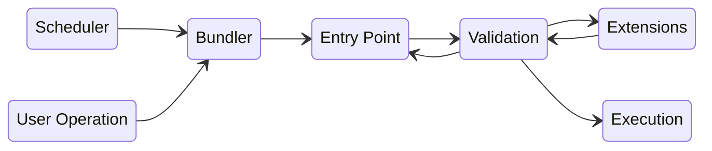

## Problem Statement

Current crypto transfers requires a user to sign transactions each time. This is advantageous as it ensures that every transaction is secure and not done against user's will (at least in theory). But with numerous dapps coming up, the average number of transactions user needs to sign is increasing. This leads leads to a UX issue and discourages the user to use a lot of dapps.
Let's take a simple example of Debit vs Credit cards: You need to manually make transactions using a debit card, but a credit card allows you to schedule payments and get subscriptions, which makes it the UX smooth and therefore it's one of the contributing factors to why people spend more on credit card.

## Solution

A framework that allows dApps to request for permissions to withdraw/deposit funds as they need and allows users to grant permissions for multiple transfers using a single transaction.
Why a framework? By being a framework, we:
a. Give Developers complete freedom to build permissions as per their needs.
b. Give Users the transparency and trust to ensure that what they approve is what can _possibly_ be removed

## EIP 4337 Flow

Below is a very high level of EIP 4337 flow with an additional Scheduler and a modified Validation block

**User Operation:** Pseudo Transaction object, refer EIP 4337

**Bundler:** Packaging User Operations similar to block builder, refer EIP 4337

**Entry Point:** A singleton contract that executes UserOperations, refer EIP 4337

**Scheduler:** It is a decentralized network of nodes that executes transactions on behalf of users/dApps. This block is crucial for enabling services such as subscriptions, recurring payments, etc.

**Validation (Modified):** The EIP 4337 Validation verifies the transaction. Once the transaction is verified, the permissions are checked for the transaction.

**Extension:** The core part of permissions granted by the user to another dApp/contract. Discussed in detail in the next section

## Extension

Extension functionality allows the smart contract wallet plug and play extensibility which can be utilised to extend the core functionality of the wallet. This would be dependent on `delegatecall` in the way diamond proxy pattern currently works and allow user to add new `facets` to the wallet effectively extending its functionality. Users can utilise the above defined permission pattern to allow restricted functionality to these facets for security purposes.
