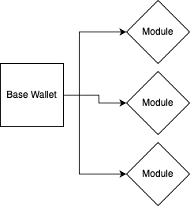

## Problem Statement

The biggest problem with wallets right now is their restrictive nature, you and even the DApps you use are forced to abide by the rules your EOA wallets set up and there's not much you can do about it, be it for transaction automation, advanced permission handling or any other custom function, we plan to change that.

## Solution

We want to build a build your own wallet standarad, where we provide users with a base wallet that they can use as they'd use any EOA or even regular multisigs. What'd make this special though would be its ability to connect with 'modules', modules would be a wallet extension standard specific to our solution that'd allow developers to extend user's wallets as required. This could mean GameFi and DeFi specific modules or even DApp specific modules, you add it once and it transforms your wallet.

### Modules

Account modules would be able to add further functionality to the wallets. These would be contract functions called using `delegatecall`. This functionality would work in a similar manner to adding facets in `diamond proxy`. The real difference would be the core permission standard that would ensure user assigned restrictions to the function call.

### Permissions

User would be able to customise and modify access of these plugin modules using permission sets in their wallets. Their would be a base set of permissions and then extended permission that'd ship along with the modules.

### Base Modules

We'd also be building a base set of modules that users can plug in their wallets right out of the box. These would include gas payments using stables, transaction automations, token streaming and more.

## Future

### Decentralised Architecture for module support

We'd like to build a decentralised architecture similar to chainlink that'd execute module specific actions for the user, this could be gasless transactions, scheduling, auto borrowing and much more. The possibilities are truly endless there.
